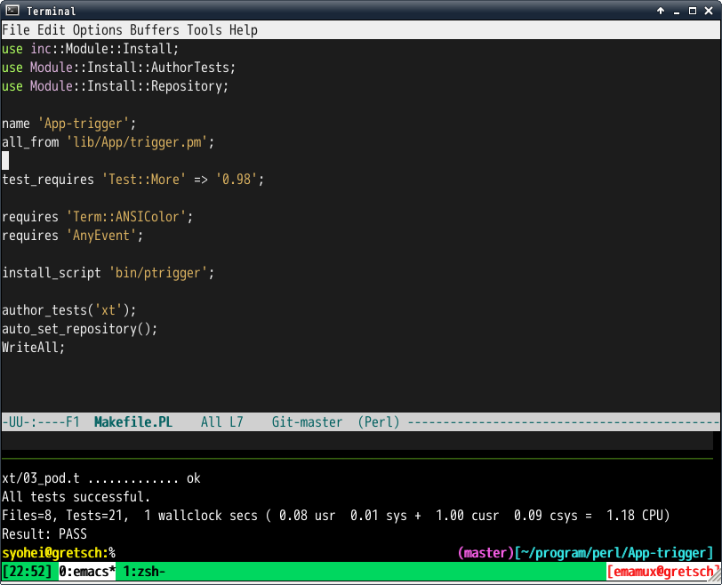
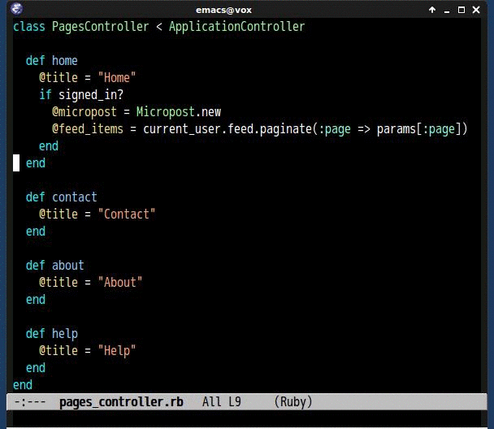

# emamux.el [![melpa badge][melpa-badge]][melpa-link] [![melpa stable badge][melpa-stable-badge]][melpa-stable-link]

Interact with tmux from Emacs.


## Screenshot




## Introduction

**emamux.el** let emacs interact with **tmux**.
**emamux.el** is inspired by [tslime.vim](https://github.com/kikijump/tslime.vim) and
[vimux](https://github.com/benmills/vimux/).


## Installation

`emamux` is available on [MELPA](https://melpa.org/) and [MELPA stable](https://stable.melpa.org/)

You can install `emamux` with the following command.

<kbd>M-x package-install [RET] emamux [RET]</kbd>


## Requirements

* Emacs 24 or higher.
* tmux 1.5


## Basic Usage

#### `emamux:send-command`

Send command to specified *target-session*(session:window.pane).

Following is `emamux:send-command` demo with ido completion.



**target-session** is set as default at first `emamux:send-command` called.
You can change default **target-session** with `C-u` prefix.

#### `emamux:yank-from-list-buffers`

Yank from `tmux` buffer.


#### `emamux:copy-kill-ring`

Copy content of (car kill-ring) to tmux buffer

You can change buffer index with Numerical Prefix.


**Following commands can be executed only within tmux**

#### `emamux:run-command`

Run command in a small split pane(`runner pane`) where emacs is in.

#### `emamux:run-last-command`

Run last command in `runner pane`.

#### `emamux:zoom-runner`

Zoom runner `runner pane`. This command requires tmux 1.8 or higher.

#### `emamux:inspect-runner`

Move into the `runner pane` and enter the copy mode.

#### `emamux:close-runner-pane`

Close `runner pane`.

#### `emamux:close-panes`

Close all other panes in current window.

#### `emamux:interrupt-runner`

Interrupt command which is running in `runner-pane`.

#### `emamux:clear-runner-history`

Clear tmux history in `runner-pane`


## Customize

#### `emamux:completing-read-type`

Completing read function type. You can choice from `'normal` or `'ido`, or `'helm`.

#### `emamux:default-orientation`

Orientation of split pane, 'vertical or 'horizonal(Default is 'vertical).

#### `emamux:runner-pane-height`

Height of `runner-pane`(Default is 20).


#### `emamux:use-nearest-pane`

Use nearest pane as `runner pane` instead of splitting pane(Default is nil).


## tmux configuration

It is useful for using `emamux` to show `session name`, `window index` and
`pane index` in tmux status bar.

```
# '#S' is session name, '#I' is window index, '#P' is pane index
set-option -g status-right '[#h###S:#I:#P]'
```

## Default keymap

`emamux` defines default keymap. You can use it by following configuration.

```lisp
;; Bind keymap prefix to Ctrl-z
(global-set-key (kbd "C-z") emamux:keymap)
```

Default keymap is as below.

| Key                   | Command                          |
|:---------------------:|:---------------------------------|
| <kbd>Prefix C-s</kbd> | emamux:send-command              |
| <kbd>Prefix C-y</kbd> | emamux:yank-from-list-buffers    |
| <kbd>Prefix M-!</kbd> | emamux:run-command               |
| <kbd>Prefix M-r</kbd> | emamux:run-last-command          |
| <kbd>Prefix M-s</kbd> | emamux:run-region                |
| <kbd>Prefix C-i</kbd> | emamux:inspect-runner            |
| <kbd>Prefix C-k</kbd> | emamux:close-panes               |
| <kbd>Prefix C-c</kbd> | emamux:interrupt-runner          |
| <kbd>Prefix M-k</kbd> | emamux:clear-runner-history      |
| <kbd>Prefix c</kbd>   | emamux:new-window                |
| <kbd>Prefix C</kbd>   | emamux:clone-current-frame       |
| <kbd>Prefix 2</kbd>   | emamux:split-window              |
| <kbd>Prefix 3</kbd>   | emamux:split-window-horizontally |


## Sample configuration

```lisp
(custom-set-variables
 '(emamux:completing-read-type 'helm))
```

## Emamux Applications

* [emamux-perl-test](https://github.com/syohex/emamux-perl-test) a set of commands to easily run perl tests
* [emamux-ruby-test](https://github.com/syohex/emamux-ruby-test) a set of commands to easily run ruby tests


## See Also
* [vimux](https://github.com/benmills/vimux/)
* [tslime.vim](https://github.com/kikijump/tslime.vim)

[melpa-link]: https://melpa.org/#/emamux
[melpa-stable-link]: https://stable.melpa.org/#/emamux
[melpa-badge]: https://melpa.org/packages/emamux-badge.svg
[melpa-stable-badge]: https://stable.melpa.org/packages/emamux-badge.svg
